# Pattern Previews

Static renders of all 18 firmware LED patterns.
Each image shows the pattern animating over time (left to right).
Vertical axis = LED position on the strip (31 display LEDs).

**Regenerate:** `python3 scripts/generate_pattern_previews.py`

## Basic Patterns (0-10)

| # | Pattern | Preview |
|---|---------|---------|
| 0 | Rainbow | 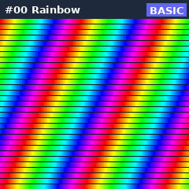 |
| 1 | Wave | 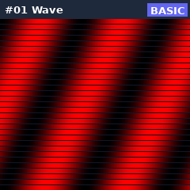 |
| 2 | Gradient | 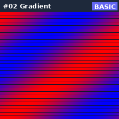 |
| 3 | Sparkle | 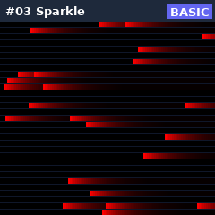 |
| 4 | Fire | 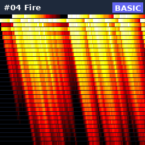 |
| 5 | Comet | 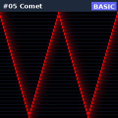 |
| 6 | Breathing | 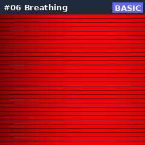 |
| 7 | Strobe | 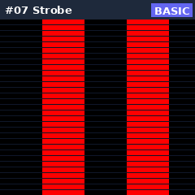 |
| 8 | Meteor | 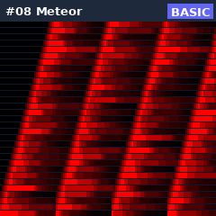 |
| 9 | Wipe | 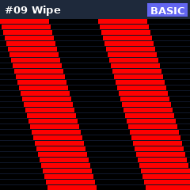 |
| 10 | Plasma | 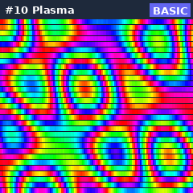 |

## Audio-Reactive Patterns (11-15)

These patterns respond to audio input. Previews use simulated audio.

| # | Pattern | Preview |
|---|---------|---------|
| 11 | VU Meter | 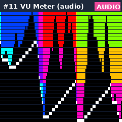 |
| 12 | Pulse | 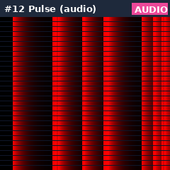 |
| 13 | Audio Rainbow | 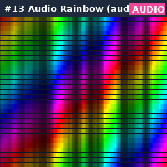 |
| 14 | Center Burst | 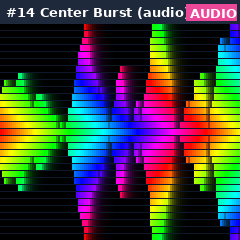 |
| 15 | Audio Sparkle | 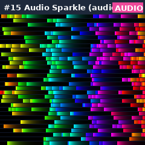 |

## Advanced Patterns (16-17)

| # | Pattern | Preview |
|---|---------|---------|
| 16 | Split Spin | 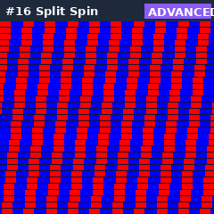 |
| 17 | Theater Chase | 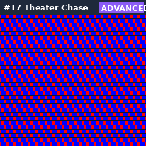 |
