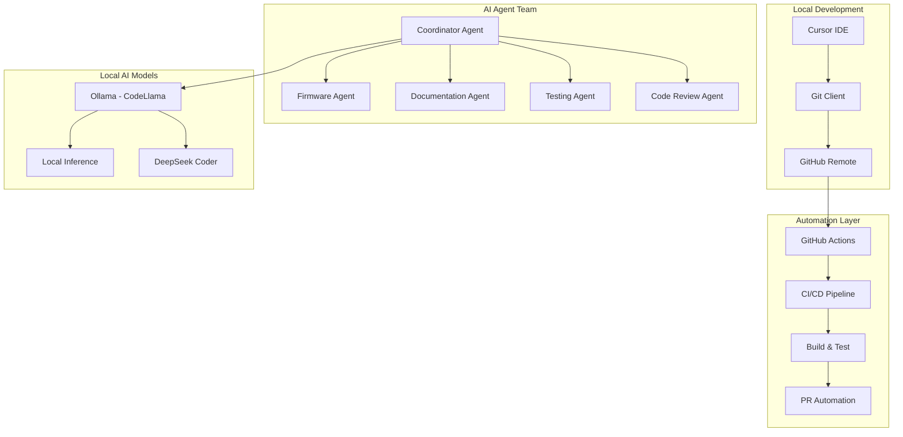
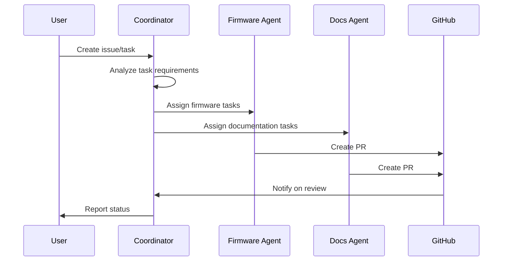

# Autonomous AI Agent Team Setup for Wireless POV POI Project

## Executive Summary

This document outlines a complete setup for an autonomous AI agent team to develop and maintain the Wireless POV POI project using free or low-cost tiers. The system uses a multi-agent architecture with specialized agents for different aspects of the project.

## Budget Overview

| Component | Monthly Cost | Notes |
|-----------|--------------|-------|
| GitHub Free | $0 | Unlimited public repos |
| GitHub Actions | $0 | 2,000 mins/month free |
| Cursor IDE (Free) | $0 | Limited AI requests |
| Ollama (Local) | $0 | Run models locally |
| Total | $0 | Fully free setup |

---

## Architecture Overview



---

## 1. Agent Team Structure

### 1.1 Coordinator Agent

**Purpose**: Orchestrates all other agents, manages task assignment, and handles PR reviews.

**Tools**:
- GitHub Discussions for task tracking
- GitHub Projects for sprint management
- Claude API (free tier: limited requests) or local Ollama model

**Responsibilities**:
- Parse GitHub issues into actionable tasks
- Assign tasks to specialized agents
- Review and merge PRs
- Generate weekly status reports

### 1.2 Firmware Agent

**Purpose**: Handle all firmware development (Teensy 4.1, ESP32, PlatformIO).

**Tools**:
- Cursor IDE with C++ extension
- PlatformIO extension
- Serial monitoring tools

**Responsibilities**:
- Complete PlatformIO firmware testing (4-8 hours remaining)
- Implement new patterns and features
- Fix bugs reported in firmware
- Optimize LED rendering performance

**Files of Interest**:
- `firmware/teensy41/` - PlatformIO firmware
- `esp32_firmware/` - ESP32 firmware
- `teensy_firmware/` - Arduino firmware

### 1.3 Documentation Agent

**Purpose**: Maintain and improve all project documentation.

**Tools**:
- Cursor IDE with Markdown support
- docsify for local preview
- GitBook (free tier)

**Responsibilities**:
- Update README and guides
- Add code comments
- Create tutorial videos (scripts)
- Maintain API documentation

### 1.4 Testing Agent

**Purpose**: Automated testing and quality assurance.

**Tools**:
- Python pytest framework
- PlatformIO test framework
- GitHub Actions

**Responsibilities**:
- Run automated tests on PRs
- Generate test coverage reports
- Performance benchmarking
- Integration testing

### 1.5 Code Review Agent

**Purpose**: Automated code review and style enforcement.

**Tools**:
- GitHub Actions with custom scripts
- clang-tidy for C++
- flake8 for Python

**Responsibilities**:
- Check code style
- Verify compilation
- Security scanning
- Performance analysis

---

## 2. Setup Instructions

### 2.1 Local Development Environment

#### Step 1: Install Cursor IDE (Free)
```bash
# Download from https://cursor.sh/
# Sign up for free tier
# Configure settings:
# - AI Model: Claude 3.5 Sonnet (limited) or GPT-4o (limited)
# - Enable local model support via Ollama
```

#### Step 2: Install Ollama (Free - Local Models)
```bash
# Install Ollama
curl -fsSL https://ollama.ai/install.sh | sh

# Pull lightweight coding models
ollama pull codellama:7b-instruct
ollama pull deepseek-coder:6.7b-instruct
ollama pull llama3.2:3b

# Verify installation
ollama list
```

#### Step 3: Configure GitHub Token
```bash
# Create personal access token
# Settings > Developer settings > Personal access tokens > Tokens (classic)
# Select: repo, workflow, read:org

# Set as environment variable
export GITHUB_TOKEN="your_token_here"
```

### 2.2 GitHub Actions Workflow Setup

Create `.github/workflows/ai-agent.yml`:

```yaml
name: AI Agent Automation

on:
  issue_comment:
    types: [created]
  pull_request:
    types: [opened, synchronize]
  schedule:
    - cron: '0 0 * * 0'  # Weekly on Sunday

jobs:
  firmware-build:
    runs-on: ubuntu-latest
    steps:
      - uses: actions/checkout@v4
      - name: Setup PlatformIO
        uses: platformio/action pio-install@v1
      - name: Build Teensy Firmware
        run: pio run -d firmware/teensy41 -e teensy41
      - name: Build ESP32 Firmware
        run: pio run -d esp32_firmware -e esp32dev
      - name: Run Tests
        run: |
          python -m pytest examples/ -v
          python -m pytest scripts/ -v

  ai-code-review:
    runs-on: ubuntu-latest
    steps:
      - uses: actions/checkout@v4
      - name: AI Code Review
        run: |
          # Script to analyze code changes
          # Can use local Ollama model for analysis
          bash scripts/ai-review.sh ${{ github.event.pull_request.number }}
        env:
          GITHUB_TOKEN: ${{ secrets.GITHUB_TOKEN }}

  generate-docs:
    runs-on: ubuntu-latest
    steps:
      - uses: actions/checkout@v4
      - name: Update Documentation
        run: |
          # Generate API docs
          # Update README with new features
          bash scripts/generate-docs.sh
```

### 2.3 Agent Task System

Create `scripts/agent-tasks/` directory with task definitions:

#### Task Format: `.github/tasks/*.md`
```markdown
# Task: Complete PlatformIO Integration Testing

**Priority**: High
**Estimated Time**: 4-8 hours
**Type**: Firmware

## Description
Complete integration testing for the PlatformIO Teensy firmware.

## Requirements
1. Upload firmware to Teensy 4.1
2. Test all display modes
3. Verify ESP32 communication
4. Test pattern rendering

## Acceptance Criteria
- [ ] All 4 patterns work correctly
- [ ] Frame rate control functional
- [ ] Brightness control works
- [ ] No compilation warnings

## Notes
Use test_teensy_standalone.py for automated testing.
```

---

## 3. Agent Coordination Protocol

### 3.1 Task Assignment Flow



### 3.2 Communication Protocol

Use GitHub Issues and PRs as the primary coordination mechanism:

1. **Task Creation**: Issues labeled with `task`, `priority`, `type`
2. **Assignment**: Auto-assigned based on `type` label
3. **Progress**: Weekly sync via GitHub Discussion
4. **Review**: PR reviews by Coordinator Agent

### 3.3 Task Labels

| Label | Description | Assigned Agent |
|-------|-------------|----------------|
| `type:firmware` | Firmware development | Firmware Agent |
| `type:docs` | Documentation | Documentation Agent |
| `type:test` | Testing | Testing Agent |
| `type:review` | Code review | Code Review Agent |
| `priority:high` | High priority | All agents |
| `priority:medium` | Medium priority | As available |
| `status:ready` | Ready to start | - |
| `status:in-progress` | Currently working | - |

---

## 4. Automation Scripts

### 4.1 Agent Dispatcher Script

Create `scripts/agent-dispatcher.py`:

```python
#!/usr/bin/env python3
"""
AI Agent Dispatcher - Routes tasks to appropriate agents
"""

import os
import github
from pathlib import Path

class AgentDispatcher:
    def __init__(self):
        self.gh = github.Github(os.environ['GITHUB_TOKEN'])
        self.repo = self.gh.get_repo("user/wireless-pov-poi")
        
    def dispatch_task(self, issue):
        """Route task to appropriate agent based on labels"""
        labels = [label.name for label in issue.labels]
        
        if 'type:firmware' in labels:
            self._assign_firmware_agent(issue)
        elif 'type:docs' in labels:
            self._assign_docs_agent(issue)
        elif 'type:test' in labels:
            self._assign_testing_agent(issue)
    
    def _assign_firmware_agent(self, issue):
        """Trigger firmware agent for task"""
        # Create branch for work
        branch_name = f"firmware/{issue.number}-{issue.title[:20]}"
        # Generate task file for firmware agent
        task_file = f".github/tasks/firmware-{issue.number}.md"
        # Post comment with agent instructions
        issue.create_comment(f"🤖 Firmware agent assigned. Task file: {task_file}")

if __name__ == "__main__":
    dispatcher = AgentDispatcher()
    # Process open issues
    for issue in dispatcher.repo.get_issues(state='open'):
        if 'status:ready' in [l.name for l in issue.labels]:
            dispatcher.dispatch_task(issue)
```

### 4.2 CI/CD Integration

Create `.github/workflows/agent-automation.yml`:

```yaml
name: Agent Automation

on:
  schedule:
    - cron: '0 */4 * * *'  # Every 4 hours
  workflow_dispatch:

jobs:
  check-tasks:
    runs-on: ubuntu-latest
    steps:
      - uses: actions/checkout@v4
      - name: Run Agent Dispatcher
        run: python scripts/agent-dispatcher.py
        env:
          GITHUB_TOKEN: ${{ secrets.GITHUB_TOKEN }}
```

---

## 5. Local AI Model Configuration

### 5.1 Ollama Model Setup

```bash
# Create a file for model configuration
cat > ~/.ollama/models.json << 'EOF'
{
  "models": [
    {
      "name": "codellama:7b-instruct",
      "purpose": "Code generation and refactoring"
    },
    {
      "name": "deepseek-coder:6.7b-instruct",
      "purpose": "Bug fixing and debugging"
    },
    {
      "name": "llama3.2:3b",
      "purpose": "Documentation and general tasks"
    }
  ]
}
EOF
```

### 5.2 Cursor IDE Integration

In Cursor settings (`~/.cursor/settings.json`):

```json
{
  "AI": {
    "provider": "ollama",
    "ollama": {
      "model": "codellama:7b-instruct",
      "baseUrl": "http://localhost:11434"
    }
  },
  "Editor": {
    "formatOnSave": true,
    "defaultFormatter": "esbenp.prettier-vscode"
  }
}
```

---

## 6. Task Priorities for Your Project

Based on the remaining work analysis, here are the recommended tasks for your AI agent team:

### Phase 1: Critical (1-2 weeks)
1. **Complete PlatformIO Integration Testing** (4-8 hours)
   - Test all 4 patterns
   - Verify ESP32 communication
   - Validate frame rate control

2. **Fix Critical Issues**
   - Address any compilation warnings
   - Fix reported bugs

### Phase 2: Important (2-4 weeks)
1. **Documentation Updates**
   - Update README with PlatformIO instructions
   - Add troubleshooting guide for common issues

2. **Test Coverage**
   - Increase test coverage for Python tools
   - Add firmware unit tests

### Phase 3: Nice to Have (4-8 weeks)
1. **New Features**
   - IMU support for rotation detection
   - Battery monitoring
   - Advanced patterns

2. **Tools Improvements**
   - Enhanced image converter
   - Better GUI tools

---

## 7. Cost Breakdown (Monthly)

| Tool | Free Tier | Cost if Exceeded |
|------|-----------|------------------|
| GitHub | Unlimited public repos | N/A |
| GitHub Actions | 2,000 mins/month | $0.008/min |
| Cursor IDE | 500 AI requests/month | $20/month |
| Ollama | Unlimited (local) | $0 |
| **Total** | **Fully functional** | **~$0-20/month** |

---

## 8. Success Metrics

Track progress with these metrics:

| Metric | Target | Measurement |
|--------|--------|-------------|
| PRs Merged | 4+/month | GitHub Insights |
| Test Coverage | >80% | Coverage reports |
| Build Success | >95% | CI/CD status |
| Issue Resolution | <7 days avg | GitHub Issues |
| Documentation Updates | 2+/month | Git history |

---

## 9. Getting Started Checklist

- [ ] Set up GitHub account and repository
- [ ] Install Cursor IDE and configure free tier
- [ ] Install and configure Ollama with coding models
- [ ] Set up GitHub Actions workflows
- [ ] Create task templates in `.github/tasks/`
- [ ] Configure agent dispatcher script
- [ ] Label existing issues for agent assignment
- [ ] Run first agent cycle manually
- [ ] Schedule automated agent runs
- [ ] Monitor and adjust agent behavior

---

## 10. Next Steps

1. **Immediate**: Set up the local environment (2-3 hours)
2. **This Week**: Run first agent tasks manually (4-8 hours)
3. **Next Week**: Automate agent runs via GitHub Actions
4. **Ongoing**: Monitor and improve agent coordination

---

*Document Version: 1.0*  
*Created: January 2026*  
*Project: Wireless POV POI*
